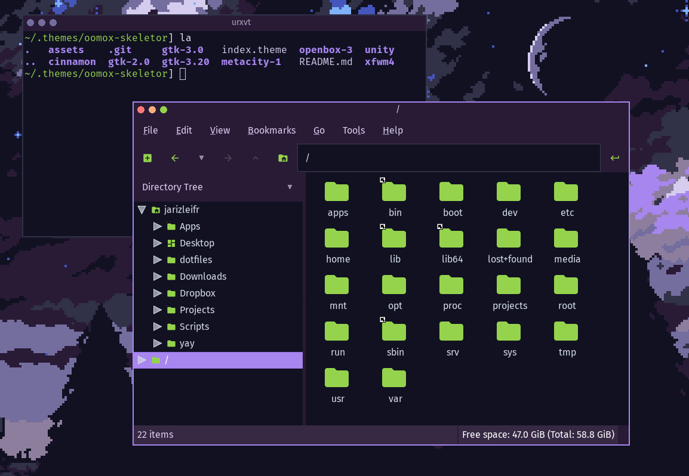

# skeletor-oomox

A theme for personal use, made with [Oomox](https://github.com/themix-project/oomox), with Openbox theme tweaked a bit by hand. I'm using a custom palette based on my own personal sensibilities.

## Screenshots

Using Fira Code and Fira Sans as fonts, with Openbox and GTK represented here. The icon theme used is Archdroid with custom coloring.

